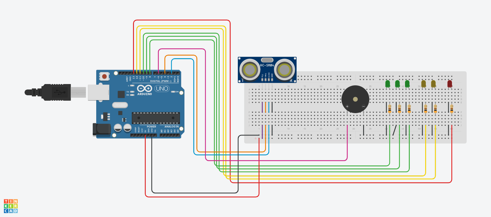
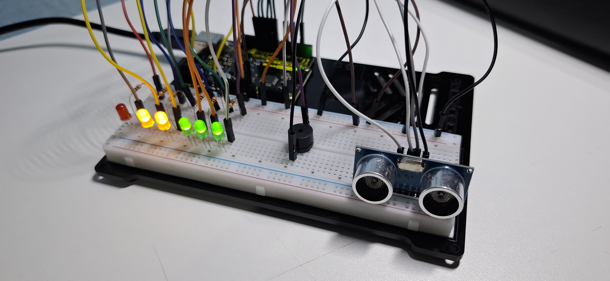

# Sensor-de-Proximidade

Este projeto tem como objetivo verificar o funcionamento de um sensor ultrassônico. Na construção do protótipo, foram utilizados LEDs e um buzzer a fim de comunicar situações de maior proximidade.

  
 

Em suma, o sistema funciona com um alarme escalável, isto é, quanto mais próximo um objeto está do sensor, mais LEDS são acionados e maior é a frequência do sinal sonoro.

---
## Componentes utilizados
  - Arduino Uno (1x)
  - Sensor Ultrassônico HC-SR04 (1x)
  - Buzzer Passivo 5 V (1x)
  - LED Verde 5 mm (3x)
  - LED Amarelo 5 mm (2x)
  - LED Vermelho 5 mm (1x)
  - Resistor 300 Ω (6x)
  - Protoboard (1x)
  - Jumpers

---
## Esquemático do Circuito

  

 

**Legenda:**
  - D13 -> LED Vermelho
  - D12 -> LED Amarelo
  - D11 -> LED Amarelo
  - D10 -> LED Verde
  - D9 -> LED Verde
  - D8 -> LED Verde
  - D6 -> Buzzer (+)
  - D4 -> Sensor Ultrassônico (TRIG)
  - D2 -> Sensor Ultrassônico (ECHO)
  - 5 V -> Sensor Ultrassônico (VCC)
  - Resistores: 300 Ω

---
## Montagem e Funcionamento

  

 

🎥 **Vídeo do Funcionamento:**  
👉 [Acesse clicando aqui!](https://youtu.be/SsBZyA)

---
## Código do Projeto
Quer ver como esse projeto foi programado?  
👉 [Acesse o código clicando aqui!](sensor-de-proximidade/sensor-de-proximidade.ino)
